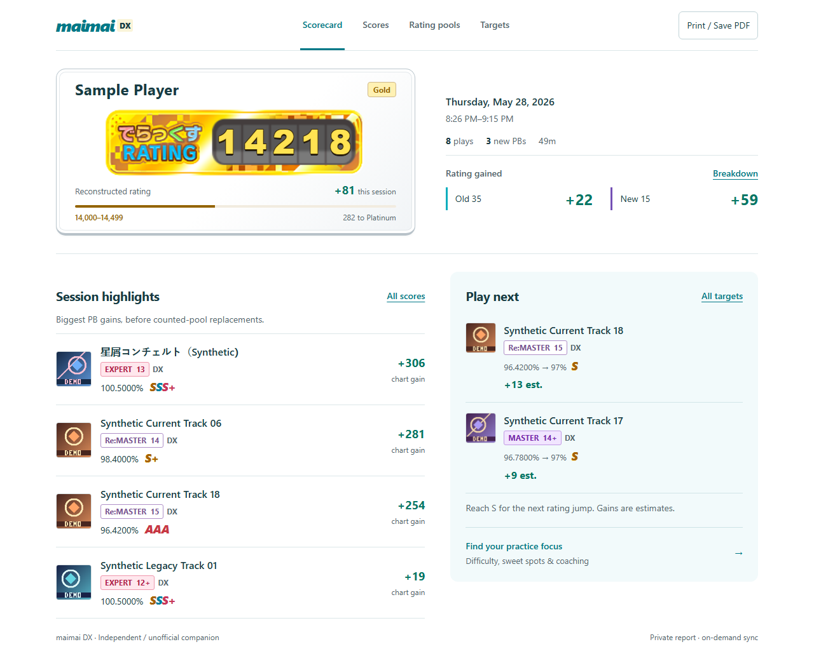
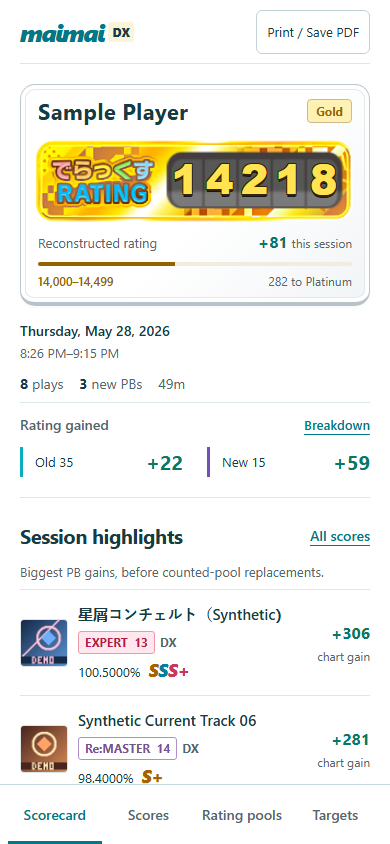
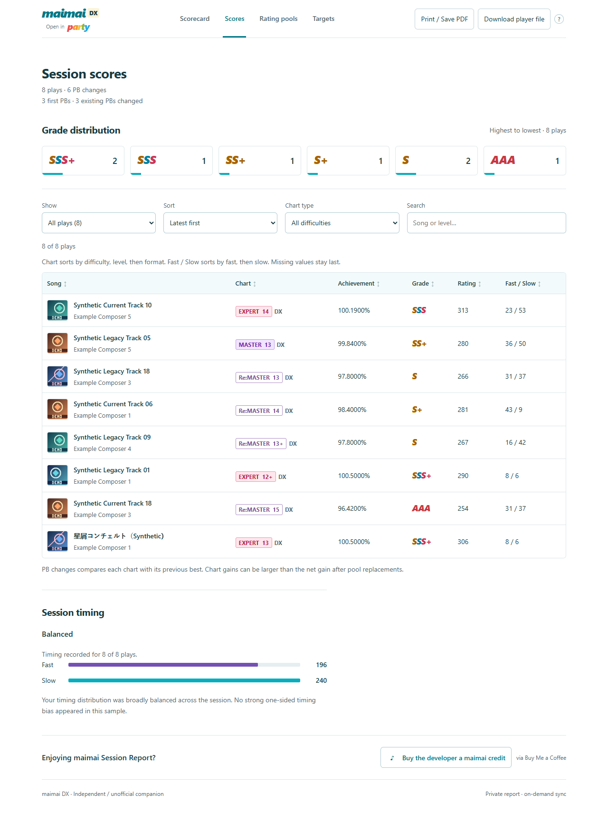

# maimai Session Report

Session reports, rating progress, and practice targets.

Turn a maimai DX session into a report you can keep as a single HTML file.
See what improved, how your Old 35 / New 15 pools changed, and which charts are
close to the next rating gain. Four interactive views cover your scorecard,
scores, rating pools and practice targets, with search, score details and a
mobile layout.

Start with the fictional offline demo below. For your own scores, the CLI reads
Kamaitachi personal bests and recent plays, requests one already-configured MYT
import, waits over server-sent events, and reads the results once. Sync happens
only when you explicitly request it.

Reports contain personal play history. Keep your output and any runner repository
private. Default reports have embedded data, CSS and JavaScript, with no browser
network requests, analytics, remote fonts or account requirement to open the file.

## See the report

All names, songs and scores in these previews are **fictional demo data**.
These are actual browser captures of the included HTML, not mockups. Cover tiles
marked **DEMO** are original fictional artwork. Rating badges use the original
game frames sourced through Tomomai, including all 12 tiers; their ownership is
separate from our software license. [Visual compatibility](docs/VISUAL_PORT.md).



<details>
<summary>See the phone layout</summary>



</details>

<details>
<summary>See the detailed Scores view</summary>



</details>

Try the interactive [sample HTML report](docs/sample-report.html): save the raw
file as `sample-report.html`, then open it in your browser. All four views work
offline. No account, installation or hosted demo site is needed. Or generate the
same file yourself with the five commands below.

## Choose how far you want to go

| I want to… | Start here | Accounts needed |
| --- | --- | --- |
| Try the report | Five commands below | None |
| Generate my report locally | [Local setup](docs/LOCAL.md#personalize-configtoml) | Your configured Kamaitachi/MYT account |
| Run manually in GitHub Actions and download a report | [Private artifact workflow](docs/LOCAL.md#github-actions-private-artifact-mode) | A **private copy** and a Kamaitachi secret |
| Keep a protected site and session history | [Hosted installation](docs/INSTALLATION.md) | A private runner, Cloudflare and your own protected hostname |

The local path is a complete product. Hosting, history, B50 image export, song
jackets and a support footer are optional. You do not need Node.js, Cloudflare,
Docker or a database to generate the normal report.

## Five-command offline demo

Install Python **3.11 or newer** and Git first. Only cloning needs the network;
the remaining commands use no credentials or external packages.

### Windows PowerShell

```powershell
git clone https://github.com/arussin/maimai-session-report.git
py -3 -m venv .\maimai-session-report\.venv
& .\maimai-session-report\.venv\Scripts\python.exe -m pip install --no-index --no-deps .\maimai-session-report
& .\maimai-session-report\.venv\Scripts\maimai-report.exe demo --output .\maimai-session-report\output\demo-report.html
& .\maimai-session-report\.venv\Scripts\maimai-report.exe serve --file .\maimai-session-report\output\demo-report.html
```

### macOS / Linux

```bash
git clone https://github.com/arussin/maimai-session-report.git
python3 -m venv maimai-session-report/.venv
maimai-session-report/.venv/bin/python -m pip install --no-index --no-deps ./maimai-session-report
maimai-session-report/.venv/bin/maimai-report demo --output maimai-session-report/output/demo-report.html
maimai-session-report/.venv/bin/maimai-report serve --file maimai-session-report/output/demo-report.html
```

Open the printed localhost address; Ctrl+C stops the server. You can also open
`output/demo-report.html` directly. On Linux, install your distribution's Python
venv package if creating the environment reports that `ensurepip` is missing.
Check that your selected Python is at least 3.11.

All demo songs and scores are fictional. To inspect empty or incomplete pools,
add `--scenario empty` or `--scenario incomplete` to the demo command.

## Make it yours

From the cloned directory, activate the virtual environment and copy
`config.example.toml` to `config.toml`. Edit just the username, display name,
timezone and current-version names to start. Leave publishing disabled.

Follow the [token setup](docs/LOCAL.md#create-and-store-a-kamaitachi-api-token-safely)
to place your own token in `KAMAITACHI_API_TOKEN` for the current shell. Tokens
are never command-line arguments or TOML values.

```console
maimai-report doctor
maimai-report sync-and-render --output output/report.html
maimai-report serve --file output/report.html
```

That sync command saves the HTML and private JSON inputs under `output/`.
You can render the saved inputs again without another import:

```console
maimai-report render --report-input output/report-input.json --after-pbs output/after-pbs.json --output output/report.html
```

Every command also supports `python -m maimai_report`.
[Full local instructions and troubleshooting](docs/LOCAL.md) cover shell setup,
tokens, timezones, output cleanup, API/SSE failures and all commands.

## Account and MYT prerequisites

Use a Kamaitachi account with the MYT integration already working in Kamaitachi.
Set it up in that service's own UI; this project neither supplies account access
nor collects integration codes. It calls only the publicly exposed Kamaitachi
importer. [Public upstream references and scope](docs/UPSTREAM.md) explain that
boundary without documenting service internals.

## Current maimai version

Set `report.current_version_display_names` to the exact
`chart.data.displayVersion` strings used by Kamaitachi for the current release.
Check those names when the game changes version. There is no hard-coded current
release, and a live sync fails before network access if the list is empty.
See [configuration](docs/CONFIGURATION.md).

## Optional extras

- [Rating artwork packs](docs/BADGES.md): all original tier frames are included;
  export and customize a local pack, or select the CSS-only `plain` alternative.
- [Song jackets](docs/ARTWORK.md): fetched from public artwork sources at build
  time and embedded; ordinary local rendering remains offline.
- [Protected hosting and history](docs/INSTALLATION.md): a seven-file private
  runner uses shared code pinned to a full commit. This needs Cloudflare setup;
  choose it when you want an ongoing website, not merely to view one report.
- [B50 image export](adapters/tomomai/README.md): powered by
  [shedaniel/Tomomai](https://github.com/shedaniel/tomomai), with
  its own AGPL license and build dependencies.
- [Support footer](docs/SUPPORT.md): off by default. If configured, opening it
  loads a third-party checkout in an isolated iframe.

The HTML also works on an ordinary static host. An unprotected host can expose
the whole report, regardless of whether search engines index it.

## Existing private runners

This is a fresh-history standalone release. It does not move, rename or update
an existing private runner or its dependencies. Leave working installations on
their current full-commit pins until you deliberately review an upgrade. Do not
rerun bootstrap or recreate storage just to adopt this repository.

The Python distribution is `maimai-session-report`; the command stays
`maimai-report` and the module stays `maimai_report`. The root, `render/`,
`archive/`, `history/` and `installation/` action interfaces are preserved.
For an intentional upgrade, follow [migration](docs/INSTALLATION_MIGRATION.md).

## Development and project notes

See [contributing](CONTRIBUTING.md) for the tested development setup,
[architecture](docs/ARCHITECTURE.md) for the data flow, and
[security](SECURITY.md) for reporting issues using synthetic examples.

Independent community software; no affiliation with SEGA, Kamaitachi or MYT is
implied. Core code uses the [MIT license](LICENSE). The optional Tomomai adapter
uses its included AGPL license; [artwork provenance](docs/RATING_ASSETS.md) is
separate from the software license.
The default report includes SEGA game-interface artwork obtained from Tomomai.
Attribution is not a grant of artwork redistribution rights. See the exact
upstream revision, code boundaries, downstream changes and asset ownership in
[third-party notices](THIRD_PARTY_NOTICES.md). No affiliation or endorsement is implied.
