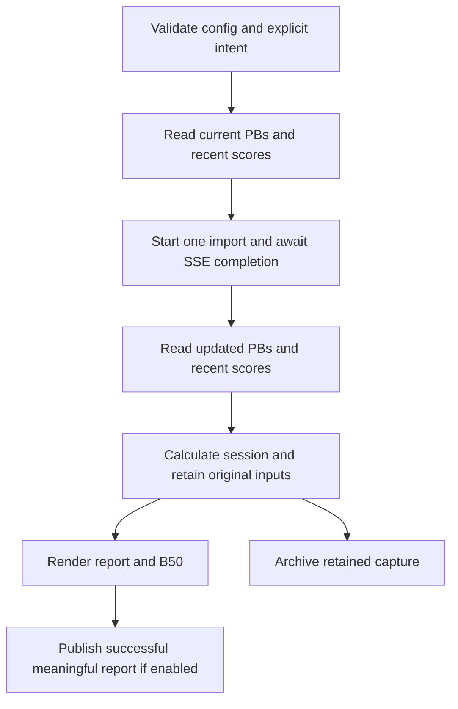

# Architecture and data flow

The calculation and rendering core is a standard-library Python package under
`src/maimai_report`. Its console entry point and `python -m maimai_report` dispatch
to the same CLI. The hosted installation adds pinned storage, artwork and deployment
adapters without adding browser-time data APIs.

## Product and installation ownership

| Location | Responsibility |
| --- | --- |
| Shared product `src/maimai_report` | Sync, analytics, embedded report, history writer/index and installation commands |
| Shared `installation/` action | Validates config and requested operation, retains private operation records and enforces deployment checks |
| Shared `deploy/cloudflare` and `adapters/tomomai` | Protected reader/Worker, deployment tooling and optional separately licensed B50 adapter |
| Private installation `instance.toml` | One owner's identity, report policy, origin, prefix and hosted resource IDs |
| Private installation four workflows | Thin validate, refresh, history and release entry points pinned to one full product SHA |
| GitHub Actions secrets | Scoped provider credentials; never serialized into TOML or source |
| Owner's private R2/D1 resources | Durable original captures and independent backup; rebuildable primary/recovery indexes |

The [installation package](INSTALLATION.md) contains seven files and references
the shared code by commit. The standalone CLI and lower-level actions also remain
supported with their separate configuration interface.

## Explicit live-sync sequence

There is no polling loop. A successful explicit run makes two PB reads, two recent-score reads, one import-start request, and one streaming request. If the stream fails or ends before a terminal `done`, the command fails instead of assuming completion or silently starting another import.

## Components

- `config.py` implements CLI/environment/TOML/default precedence, rejects secret-bearing TOML keys, and validates offline/network/publish contexts.
- `api.py` is a small injectable `urllib` client with explicit HTTPS and timeouts. It validates response envelopes and does not include response bodies in HTTP errors.
- `sse.py` parses SSE records, ignores comments/keepalives, completes only on `done`, reports `import:failed`, and rejects EOF before completion.
- `sync.py` owns the one-import orchestration and writes six auditable private JSON documents.
- `calculations.py` derives session cutoff, changed PBs, rating gains, and Old 35/New 15 pools from exact configured display-version names.
- `render.py` enriches chart/song data and emits deterministic HTML with inline CSS, inline JavaScript, and safely escaped JSON.
- `artwork.py` optionally prepares embedded raster jackets from fixed public static sources at build time; it never reads a score API.
- `server.py` provides a minimal localhost server with restrictive response headers, an allowlisted Host header, no request-target logging, and no wildcard bind.
- `fixtures/` contains synthetic scenarios only. No fixture is fetched from an account or historical artifact.
- `deploy/cloudflare/` is an optional Node-based adapter. It is never imported by the Python package and has no automatic trigger.
- `installation/config.py` validates the owner TOML and common workflow pin; conflicting legacy environment settings are rejected.
- `installation/operations.py` runs retained render/archive/backup/rebuild operations without an import; `deployment.py` prepares and verifies retained releases and rollback.
- `installation/verification.py` exercises fresh hosted storage with synthetic captures, journals owned writes and verifies scoped cleanup; it never deploys or imports scores.

## Report boundary

The renderer escapes `<`, `>`, `&`, U+2028, and U+2029 in embedded JSON, so a title such as `</script>` cannot terminate the script-data element. Presentation code uses text-safe DOM operations for player and score content. The removable developer-support footer is enabled by default; it permits only the fixed Buy Me a Coffee origin in its matching CSP and trusted footer script. Its checkout loads only after a click. With support disabled, the completed HTML contains no HTTP/HTTPS URL and omits the checkout script. Song artwork and rating frames are embedded; there is no remote font, third-party parent script, analytics endpoint or runtime data fetch.

The absence of network activity does not make the file anonymous: the embedded report data is the product. Anyone who can read the HTML can read the play history.

## Private output

`sync` writes the before/after API envelopes, derived report input, and metadata atomically. Where supported, files receive owner-only mode `0600`; filesystem ACLs remain authoritative. The paths are ignored by Git, but ignore rules do not protect copies, backups, Actions downloads, screenshots, browser caches, or hosted files.

The report is a deterministic rendering of input fixtures for tests. Timestamps originate in fixture/input data rather than renderer network calls.

## API behavior audited against upstream

The implementation preserves the Tachi/Kamaitachi compatibility contract audited at commit `4f6048aaac4d0033e614401b0692a3785b78e149`. This is a pinned reference, not a claim that the upstream development branch or deployed service is frozen:

- The client sends bearer authentication as `Authorization: Bearer <key>` to the configured Kamaitachi API.
- [Import route source](https://github.com/zkldi/Tachi/blob/4f6048aaac4d0033e614401b0692a3785b78e149/typescript/server/src/server/router/api/v1/import/router.ts): from-API import accepts an `importType`, requires explicit user intent, and returns HTTP 202 with an import ID.
- [Import SSE route](https://github.com/zkldi/Tachi/blob/4f6048aaac4d0033e614401b0692a3785b78e149/typescript/server/src/server/router/api/v1/imports/router.ts): the stream emits progress/terminal events, keepalives, and a server timeout.
- [Official client import hook](https://github.com/zkldi/Tachi/blob/4f6048aaac4d0033e614401b0692a3785b78e149/typescript/client/src/components/util/import/useImport.ts): the audited client consumes the SSE stream.
- [PB route source](https://github.com/zkldi/Tachi/blob/4f6048aaac4d0033e614401b0692a3785b78e149/typescript/server/src/server/router/api/v1/users/_userID/games/_game/_playtype/pbs/router.ts) and [score route source](https://github.com/zkldi/Tachi/blob/4f6048aaac4d0033e614401b0692a3785b78e149/typescript/server/src/server/router/api/v1/users/_userID/games/_game/_playtype/scores/router.ts): responses carry score/PB records with chart and song collections; recent scores are capped at 100.

External APIs can change. Tests mock the audited contract and never contact the service. Review upstream behavior before intentionally changing endpoints, event names, authentication, or importer identifiers.

## CI and deployment boundaries

Ordinary CI runs Python lint/tests, CLI smoke checks, synthetic demos, Worker tests,
browser behavior tests and the actual installation ZIP/composite-action validation.
It has read-only repository permission and no Kamaitachi or Cloudflare secrets.
Offline storage test doubles exercise the recovery protocol. Testing a hosted
installation's real credentials and storage requires a separate explicit operation.

The packaged refresh is manual-only and requires a private caller. Capture,
archival and optional publication are separate jobs. Archival can preserve retained
inputs even if B50/render fails; publication requires a successful meaningful build.
An empty capture never displaces the meaningful latest pointer or static fallback.
A sync rerun is rejected; history/release operations resume the retained original
run instead.

History and release operations use the `production` Environment. Setup and fresh
verification require explicit apply; release operations also check identity,
Access, bindings, alternate domains and drift before changing a Worker. Fresh
verification refuses populated resources and removes only its own synthetic data.
These operations cannot start an import. See the [operation table](INSTALLATION.md#operations-retained-retries-and-downloads).

The legacy single-file artifact/publish workflows retain their original variables,
confirmation and `private-report-production` Environment. They are documented
separately in [Deployment](DEPLOYMENT.md); they are not the hosted installation path.
